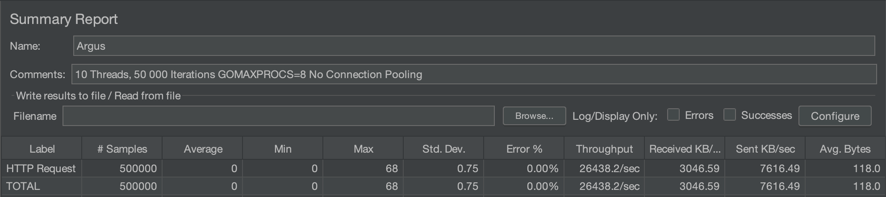
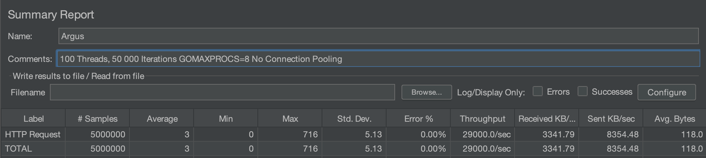

[](https://circleci.com/gh/dominicfollett/argus-db)

# Argus

<p align="center">
    
</p>

## Description

A simple rate limiter service written in Golang. This was built as a quick exercise to revise concurrency in Go.
The rate limiter uses a thread-safe BST to store records. A 'shadow' AVL tree is periodically swapped with the BST
to provide eventual log(n) guarantees for tree accesses.

## Known Issues

- [RESOLVED] Occassionally under heavy concurrent requests, a Read Lock is not being correctly released leading to starvation
of the switchover go routine that handle tree swapping.

## Todos

- [DONE] Add a function to periodically remove stale records
- The metric used for triggering a tree swap is pretty dubious, so that needs a rethink
- Perform profiling and implement optimizations (e.g. custom json decoding among others) 
- - go tool pprof -http=:8000 'http://localhost:6060/debug/pprof/profile?seconds=60'
- Implement an alternate DB engine using perhaps a thread-safe hash table.
- And lastly, there's a bit of cleanup/refactoring needed

## Performance Benchmarks

I used Jmeter to exercise Argus on an 8-core, 16G Macbook. There's no connection sharing/reuse among threads in Jmeter.
The request body:

```json
{
    "key": "${__RandomString(20,abcdefghijklmnopqrstuvwxyz,)}",
    "capacity": 1000,
    "interval": 60,
    "unit": "s"
}
```
uses a random string for each request. This obviously affects the lifetime of each record,
leading to early evictions during the running of these tests.

### Test 1
10 Threads, 50 000 Iterations GOMAXPROCS=8 No Connection Pooling
<p align="center">
    
</p>

### Test 2
100 Threads, 50 000 Iterations GOMAXPROCS=8 No Connection Pooling
<p align="center">
    
</p>
After introducing a function to remove stale records memory usage is hovering at around 3.2 Mb. Obviously
this is influenced by the early record evictions in this suite of tests. 

## Example Usage
```sh
curl -X POST -H "Content-Type: application/json" -d '{
    "key": "my_key",
    "capacity": 1,
    "interval": 5,
    "unit": "s"
}' http://localhost:8123/api/v1/limit
```

## Installation

1. Clone the repository.
2. Set environment variables
3. `make all`
4. `./bin/argus`

Alternately use the provided Dockerfile to deploy a containerized version. 

```sh
$ docker-compose up --build
```

## Contributing

Contributions are welcome. If you would like to contribute please follow these steps:

1. Fork the repository
2. Create a new branch
3. Make your changes
4. Submit a pull request

## License

This project is licensed under the [Apache License](LICENSE).
